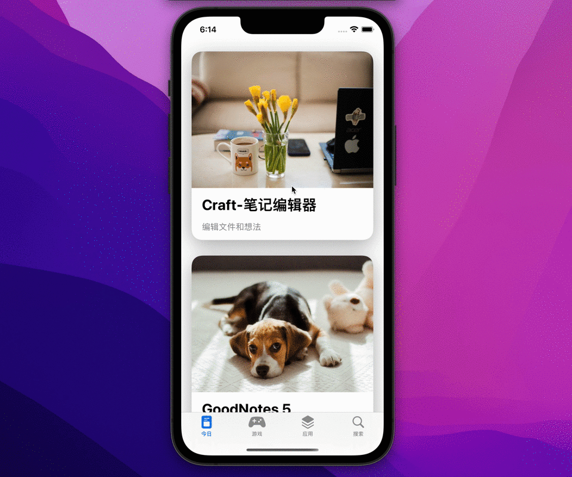

## 效果

## 目标
-   **Hero** 指的是在屏幕间飞跃的 view
-   用 matchedGeometryEffect 创建 hero 动画。
-   matchedGeometryEffect参数对效果的影响
## 代码

## 正文
### 如何实现Hero效果
`matchedGeometryEffect`装饰View时和`scaleEffect`效果一样在`withAnimation`中修改`@State`值即可触发动画效果。
他们的区别是`scaleEffect`是直接描述View需要变换成什么样子比如`.scaleEffect(1.5)`将View放大1.5倍，而`matchedGeometryEffect`则需要另外一个具有相同的id和namespace的View来描述最终变换成什么样子。

`matchedGeometryEffect`从英文的字面意思"匹配几何图形效果"可以感知到这个效果可以让View-A变成View-B的几何形状（位置、大小）

下面举个例子说明一下：
将圆形的添加按钮变换成方形的添加布局背景


```swift
@Namespace private var namespace
@State private var show = false

var body: some View {

	VStack {
	
		if show {
			RoundedRectangle(cornerRadius: 20)
			.fill(Color.blue)
			.frame(maxWidth: .infinity, maxHeight: .infinity)
			.matchedGeometryEffect(id: "id1", in: namespace)
			.onTapGesture {
				withAnimation(.spring()) {
					show = false
				}			
			}
		
		} else {
			Circle()
				.fill(Color.blue)
				.frame(width: 48, height: 48)
				.overlay(Image(systemName: "plus")
				.foregroundColor(Color.white))
				.matchedGeometryEffect(id: "id1", in: namespace)
				.frame(maxWidth: .infinity, maxHeight: .infinity, alignment: .bottomTrailing)
				.padding()		
				.onTapGesture {
					withAnimation(.spring()) {
						show = true
					}
				}
		}
	
	}.navigationViewStyle(.stack)

}
```

### matchedGeometryEffect
#### 参数
我们再来实现一个相对复杂的效果

图片和文字会从界面1飞入界面2中

当前我们显示界面2时没有隐藏界面1时控制台打印出

**Multiple inserted views in matched geometry group Pair<String, ID>(first: "Image0", second: SwiftUI.Namespace.ID(id: 1222)) have `isSource: true`, results are undefined.**
这个告警提示的意思是有多个显示的View使用了相同的id和Namespace并且isSource=true。

为什么会有这个提示这就涉及到isSource这个参数，isSource缺省为true表示两个View一个显示一个不显示他们互为对方的源View最终只有一个View呈现出来。

当两个View都需要显示时比如一个点餐的界面点击菜单，菜品飞到已点清单中这时需要将isSource设置成false，当我们点击菜单时SwiftUI会复制一个新的菜单然后飞到已点清单设置的位置和大小。

我们了解了isSource参数后发现还有两个参数没有使用过
1. properties
表示做怎样的变换，比如只匹配目标图形的位置或者大小。缺省frame即位置+大小的变换
2. anchor
即位置变换的锚点，缺省center即View-A的中心点移动到View-B的中心点

#### 如何触发动画效果
isSource=true时改变`@State var show: Bool`值触发matchedGeometryEffect动画，isSource=false后如何触发matchedGeometryEffect动画呢？
```swift
func matchedGeometryEffect<ID>(id: ID, in namespace: Namespace.ID, properties: MatchedGeometryProperties = .frame, anchor: UnitPoint = .center, isSource: Bool = true) -> some View where ID : Hashable
```
id、namespace、properties、anchor、isSource 任何一个参数的变化都会触发几何匹配变换
所以我们只需要在`withAnimation`中包含对其进行的调整就能触发matchedGeometryEffect动画。

**以上Demo代码地址**

## 尾巴
1. 使用matchedGeometryEffect的动态跟随可以实现顶部tab效果
2. 声明式UI对于生产力的提高
